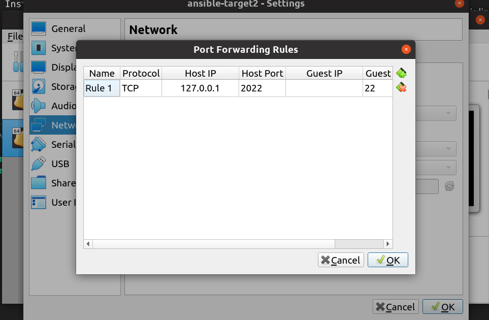
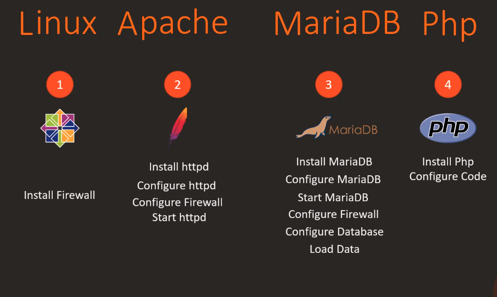
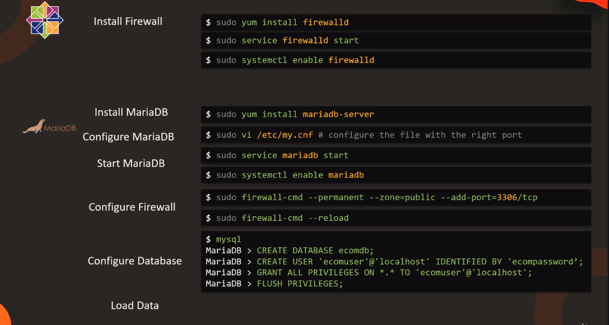
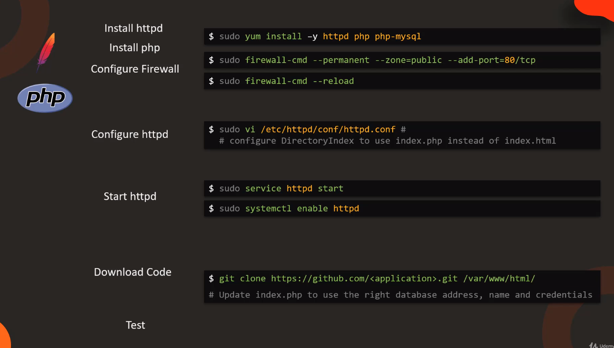

# Ansible for the Absolute Beginner - Hands-On - DevOps

## VM setup

To practice Ansible, some targetted clouds/machines are needed. I used VirtualBox to create 2 CentOS virtual environment and enabled SSH.

Install OS VDI file at [www.osboxes.org](https://www.osboxes.org/virtualbox-images) and select CentOS.

To enable SSH, add this line to Port Forwarding in Setting - Network.



Testing SSH connection (in your Linux host terminal) with:

```bash
$> ssh osboxes@127.0.0.1 -p <Host Port>
```

## YAML Tutorial

[YAML Learning](../YAML/yaml_tutorial.md)

## Ansible

### 1. Ansible

> Ad-hoc command

```bash
ansible <hosts> -a <command>
$> ansible all -a "/sbin/reboots"

ansible <hosts> -m <module>
$> ansible target1 -m ping
```

Example in this course:

### 2. Ansible Playbook

```bash
$> ansible-playbook some_playbook.yaml
```

Ping task example:

```yaml
- name: Test connectivity to target servers
  hosts: all
  tasks:
    - name: Ping test
      ping:
```

### 3. Modules

> List popular modules.
> All are well-documented in Ansible documentation.

- **command**

- **script**: copy script to remote systems and execute that script

- **service**: maintaine service (start, stop, restart) (idempotency)

```yaml
- name: Start services in order
  hosts: localhost
  tasks:
    - name: Start the database service
      service: name=postgresql state=started
```

`state=started` explaination: Ansible ensures service is started, not starting the service. If service is not already started => start it, otherwise, do nothing. => **Idempotency** => Put things in expected state.

- **lineinfile**: search for a line in a file and replace it or add it if it doesn't exist. (idempotency)

#### Formula for a play

```yaml
- name: Name of the play
  hosts: targetted_nodes
  tasks:
    - name: task1
      module1:
        parameter1: val1
        parameterN: valN
    - name: taskN
      moduleN:
```

### 4. Syntax

#### Variable

Var template is **Jinja2 Templating**.

Encode variable name in `{{ var_name}}`.

#### Condition

Use `when` in task.

```yaml
- name: Install NGINX on Debian
  apt:
    name: nginx
    state: present
  when: ansible_os_family == "Debian" and
    ansible_distribution_version == "16.04"

- name: Install NGINX on Redhat
  yum:
    name: nginx
    state: present
  when: ansible_os_family == "RedHat" or
    ansible_os_family == "SUSE"
```

#### Loops

Use `loop` in task.
Formula:

```yaml
- tasks:
    -
      module1: parameter1={{item.var1}} parameter2={{item.var2}} ...
      loop:
        - var1: val1
          var2: val2
          ...
        - var1: val3
          var2: val4
          ...
        ...
```

Example: you want to install multiple items on remote hosts.

```yaml
---
- name: Install Softwares
  hosts: all
  vars:
    packages:
      - name: nginx
        required: True
      - name: mysql
        required: True
      - name: apache
        required: False

  tasks:
    - name: Install "{{ item.name }}" on Debian
      apt:
        name: "{{ item.name}}"
        state: present

      when: item.required == True
      loop: "{{ packages}}"
```

Other example: You want to add multiple users in the list.

```yaml
---
- name: Create user
  hosts: localhost
  tasks:
    - user: name= '{{ item.name }}' state=present uid='{{ item.uid }}'
      loop:
        - name: joe
          uid: 1
        - name: john
          uid: 2
```

Other way to use loop is to use **with\_\***.

Options: with_items (random value) , with_file (path to file), with_url (url), with_mongodb (connection link), ...

Formula:

```yaml
- tasks:
    - module1: parameter={{ item }}
      with_*:
        - item1
        - item2
        - item3
        - item4
        ...
```

#### Register

> Take the output of a specific task.
> Use `register: <name_of_stored_variable>` in task.

Example: you want to send an alert email if and only if httpd service is down.

```yaml
- name: Check status of a service and email if its down
  hosts: localhost
  tasks:
    - command: service httpd status
      register: result

    - mail:
        to: admin@companycom
        subject: Service Alert
        body: Httpd Service is down
        when: result.stdout.find('down') != -1
```

### 5. Roles

> Roles are way to group multiple tasks together into one container.
> Note: Role is one way of **ENCAPSULATING** other configurations into other files. This enables modularity and reusability.

By default, roles are stored in **/etc/ansible/roles**.

```directory
project
.
├── mysql
│   ├── defaults
│   │   └── main.yml
│   ├── files
│   ├── handlers
│   │   └── main.yml
│   ├── meta
│   │   └── main.yml
│   ├── README.md
│   ├── tasks
│   │   └── main.yml
│   ├── templates
│   ├── tests
│   │   ├── inventory
│   │   └── test.yml
│   └── vars
│       └── main.yml
└── playbook.yml
```

Playbook.yml:

```yaml
- name: Install and Configure MySQL
  hosts: db-server
  roles:
    - mysql # your role name
```

To create ansible role, use `ansible-galaxy init <path_to_role_directory>`.

Search for available role at [https://galaxy.ansible.com/](https://galaxy.ansible.com/). Can install via commandline.

### 6. Advanced topics

#### Project

> Deploy a LAMP stack: Linux, Apache, MariaDB, PHP app.



Database:



Server:



Instruction: [link](https://github.com/kodekloudhub/learning-app-ecommerce/tree/master)

**Note before starting:**

- `service` vs `systemd|systemctl`: service is used for old system, operates on /etc/init.d; systemctl is more modern, operates on /lib/systemd. If systemctl is avaliable, always use it. In CentOS, service redirects to systemctl.
