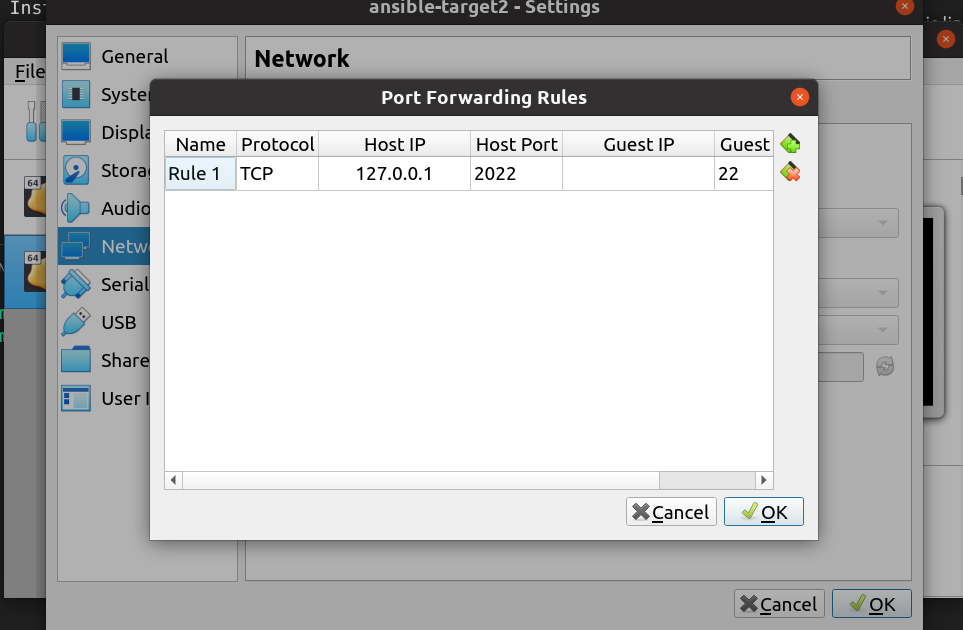

# Ansible for the Absolute Beginner - Hands-On - DevOps

## VM setup

To practice Ansible, some targetted clouds/machines are needed. I used VirtualBox to create 2 CentOS virtual environment and enabled SSH.

Install OS VDI file at [this link](https://www.osboxes.org/virtualbox-images) and select CentOS.

To enable SSH, add this line to Port Forwarding in Setting - Network.



Testing SSH connection (in your Linux host terminal) with:

```bash
$> ssh osboxes@127.0.0.1 -p <Host Port>
```

## YAML Tutorial

[YAML Learning](./YAML/yaml_tutorial.md)

## Ansible

### 1. Ansible

> Ad-hoc command

```bash
ansible <hosts> -a <command>
$> ansible all -a "/sbin/reboots"

ansible <hosts> -m <module>
$> ansible target1 -m ping
```

Example in this course:

### 2. Ansible Playbook

```bash
$> ansible-playbook some_playbook.yaml
```

Ping task example:

```yaml
- name: Test connectivity to target servers
  hosts: all
  tasks:
    - name: Ping test
      ping:
```

### 3. Modules

> List popular modules.
> All are well-documented in Ansible documentation.

- **command**

- **script**: copy script to remote systems and execute that script

- **service**: maintaine service (start, stop, restart) (idempotency)

```yaml
- name: Start services in order
  hosts: localhost
  tasks:
    - name: Start the database service
      service: name=postgresql state=started
```

`state=started` explaination: Ansible ensures service is started, not starting the service. If service is not already started => start it, otherwise, do nothing. => **Idempotency** => Put things in expected state.

- **lineinfile**: search for a line in a file and replace it or add it if it doesn't exist. (idempotency)

#### Formula for a play

```yaml
- name: Name of the play
  hosts: targetted_nodes
  tasks:
    - name: task1
      module1:
        parameter1: val1
        parameterN: valN
    - name: taskN
      moduleN:
```

### 4. Syntax

#### Variable

Var template is **Jinja2 Templating**.

Encode variable name in `{{ var_name}}`.
