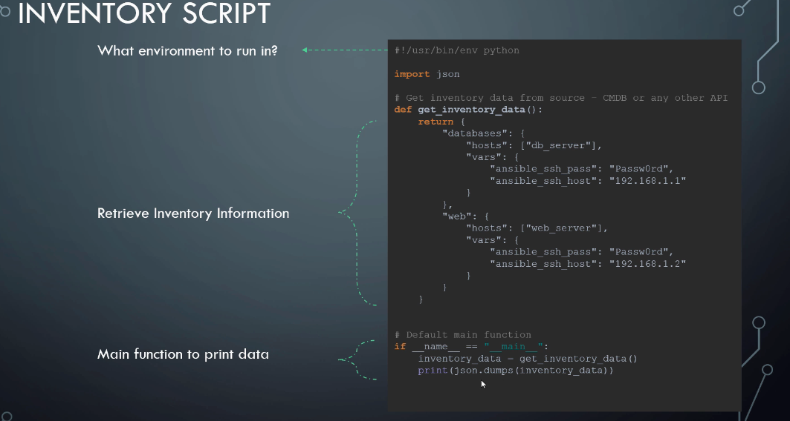

# Ansible Advnaced - Hand-On - DevOps

## Setup environment

Only neccesary if you dont have a Linux controller

- VM
- Docker
- Vagrant

## Web Application

Basic web application setup steps:

- Identify server
- Install python dependencies
- Install, configure and start MySQL

[Playbook](./Demo/playbook.yml)

```yaml
- name: Deploy a web application
  hosts: db_and_web_server
  vars:
    db_name: employee_db
    db_user: db_user
    db_password: Passw0rd
  tasks:
    - name: Install dependencies
      apt: name={{ item }} state=present
      with_items:
        - python
        - python-setuptools
        - python-dev
        - build-essential
        - python-pip
        - python-mysqldb

    - name: Install MySQL database
      apt:
        name: "{{ item }}"
        state: present
      with_items:
        - mysql-server
        - mysql-client

    - name: Start Mysql Service
      service:
        name: mysql
        state: started
        enabled: yes

    - name: Create Application Database
      mysql_db: name={{ db_name }} state=present

    - name: Create Application DB User
      mysql_user: name={{ db_user }} password={{ db_password }} priv='*.*:ALL' host='%' state='present'

    - name: Install Python Flask dependencies
      pip:
        name: "{{ item }}"
        state: present
      with_items:
        - flask
        - flask-mysql

    - name: Copy web-server code
      copy: src=app.py dest=/opt/app.py

    - name: Start web-application
      shell: FLASK_APP=/opt/app.py nohup flask run --host=0.0.0.0 &
```

**Note**:

- name: "{{ item }}"
- name={{ item }}

## File Separation

[Directory](./FileSeparation)

```bash
.
├── app.py
├── host_vars
│   └── db_and_web_server.yml
├── playbook.yml
└── tasks
    ├── deploy_db.yml
    └── deploy_web.yml
```

```yaml
- tasks:
    - name:
      normal_module:
    - include: tasks/deploy_db.yml
    - include: tasks/deploy_web.yml
```

## Roles

Take the template of premade project:

```bash
$> ansbile-galaxy init <project_template>
```

Syntax:

```yaml
- name:
  host:
  roles:
    - roles1 (directory1)
    - roles2 (directory2)
```

Role structure:

```bash
.
├── app.py
├── host_vars
│   └── db_and_web_server.yml
├── playbook.yml
└── roles
    ├── flask_web
    │   └── tasks
    │       └── main.yml
    ├── mysql_db
    │   └── tasks
    │       └── main.yml
    └── python
        └── tasks
            └── main.yml
```

Example:

```yaml
- name: Deploy a mysql DB
  hosts: db_server
  roles:
    - python
    - mysql_db

- name: Deploy a Web Server
  hosts: web_server
  roles:
    - python
    - flask_web
```

Same as File Separation but use module `roles` instead.

[Roles](./Roles)

## Ansynchronous actions

> Tell Ansible to proceed without task completion.

Use `async`, `poll` keyword.

- async: how long to run
- poll: how frequently Ansible check the status of task (default: 10s)

```yaml
- tasks:
    - module1: ...
      async: 360
      poll: N

    - module2: ...
      async: 360
      poll: N
```

For `async`, if N > 0, Ansible will wait for 360s for the task to finish. Ansible checks every N seconds. If N == 0; Ansible will not wait for completion but move immediately to the next task => asynchronization.

In short, when N == 0, task **"fire and forget"**, unless we use `register` to track the output.

Not all module supports `async`.

## Strategy

> You want to setup multiple servers. The sequence of task execution across each server is called **strategy**.

Strategies:

- linear (default): 1 task is finnished in all servers before moving to next task.
- free: tasks are independent across servers, no waiting.
- batch: based on linear strategy but you can control the number of synchronized servers. `serial: number_of_server/array/percentage`

## Error Handling

`any_errors_fatal: true`: 1 task fails on 1 server, stop all.

Use `ignore_errors: yes` to ignore erros.

```yaml
- mail:
    to: devops@corp.com
    subject: Server Deployed!
    body: Web ServerDeployed
  ignore_errors: yes
- command: cat /var/log/server.log
  register: command_output
  failed_when: "'ERROR' in command_output.stdout"
```

## Jinja Templating

> Templating: generate dynamic content, expression.

Links:
[Ansible Official Link](https://docs.ansible.com/ansible/latest/user_guide/playbooks_templating.html)

[Jinja2 Official Link](https://jinja.palletsprojects.com/en/2.11.x/)

Filter:
`{{ value | filter_method}}

- String manipulation
- List and set
- File

## Lookups

Lookup: search for content in other format (csv, ini, dns, mongodb, ...)

## Vaults

Ansible Vault stores inventory information in encrypted format.

```bash
$> ansible-vault encrypt inventory.txt
New Vault password:
Confirm New Vault password:
Encryption successful
```

To decrypt:

```bash
$> ansible-playbook playbook.yml -i inventory.txt --ask-vault-pass
Vault password:
```

```bash
## Through plain text
$> ansible-playbook playbook.yml -i inventory.txt --vault-password-file ~./vault_pass.txt

## Through script
$> ansible-playbook playbook.yml -i inventory.txt --vault-password-file ~./vault_pass.py

## View inventory
$> ansible-vault view inventory.txt

## Create inventory
$> ansible-vault create inventory.txt
```

## Dynamic Inventory

We can use __python script output__ as inventory.

```bash
$> ansible-playbook playbook.yml -i inventory,.py
```



## Custom Modules

Python code for certain purposes.
Go to [Ansible Plugin Github](https://github.com/ansible/ansible/tree/devel/lib/ansible/plugins/callback) for examples.

## Plugins

### Filter plugins example

Usage:

```yaml
-
  name: Print Average marks
  hosts: localhost
  vars:
    marks:
      - 10
      - 20
      - 30
      - 40
  
  tasks:
    - debug:
        msg: '{{ marks | average }}'

```

Plugin Python code:

```python
# /filter_plugins/average.py

def average(list):
  '''
  Find average of a list of numbers
  '''
  return sum(list) / float(len(list))

def FilterModule(object):
  def filters(self):
    return {
      'average': average
    }

```

### Callback Plugin example

> To interact with other applications: mail, hipchat, slack, ...